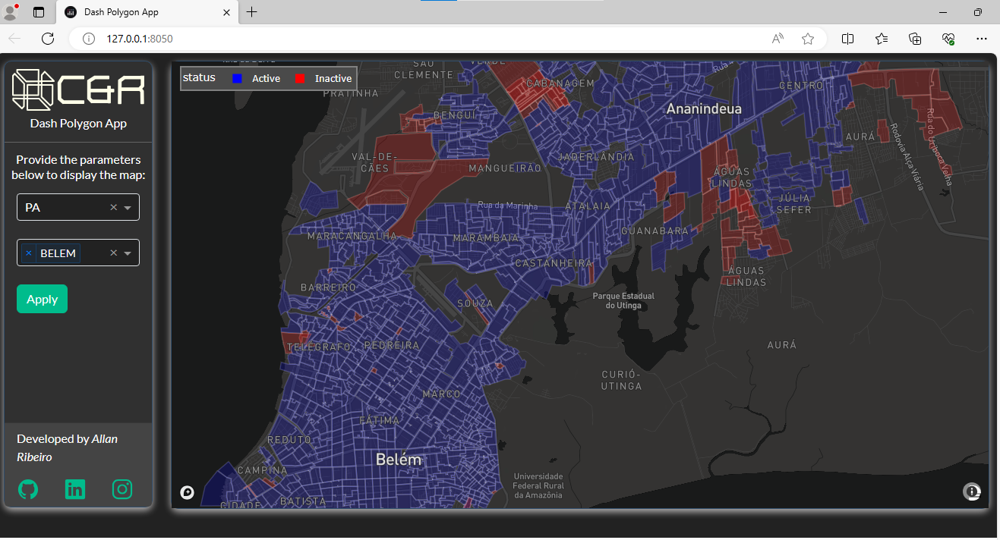

# Interactive Fiber Network Coverage Map

This project is an interactive application developed in Python using Plotly Dash. It allows visualizing fiber network coverage on a map, filtering by state (UF) and municipality.

## Features

- **State and Municipality Filtering:** Users can select the desired state (UF) and municipality to visualize fiber network coverage.
- **Network Coverage Representation:** The polygons on the map represent the fiber network coverage, where blue indicates active cells and red indicates inactive cells.
- **Detailed Visualization:** This detailed visualization aids in understanding the fiber network infrastructure in different regions, assisting in decisions related to network connectivity and expansion.

## How to Use

1. Clone this repository to your local environment.
I suggest you to create a virtual environment for running this app with Python 3. Clone this repository 
and open your terminal/command prompt in the root folder.
Add your own mapbox api key at ./assets

```
git clone https://github.com/adsribeiro/dash-polygon-app
python3 -m virtualenv venv

```
In Unix system:
```
source venv/bin/activate
```
In Windows: 

```
venv\Scripts\activate
```
2. Install project dependencies using the command:

```
pip install -r requirements.txt
```

3. Run the application using the following command:

```
python main.py
```
4. Open your web browser and access the local address indicated after executing the previous step.
5. Select the desired state (UF) and municipality to visualize fiber network coverage.

## Contributing

Contributions are welcome! Feel free to open an issue or submit a pull request with improvements or fixes.

## Screenshot



## Demo


## Resources

- [Dash](https://dash.plot.ly/)
- [Mapbox](https://www.mapbox.com/)
